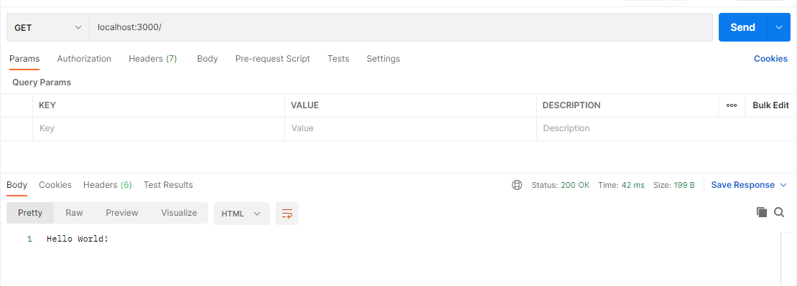

# Mock API Server using Hapi (NodeJS)

## Description

A quick boiler plate for making a hapi nodejs mock API server, used for local testing.

## Prerequisites

Download and install NodeJS and npm.

## How to use

Using your favorite terminal

```bash
git clone <this_repo_ssh/https_url>
cd hapi-api-mock
npm init
npm run server
```

You should have something like this in terminal:

```bash
$ npm run server

> mock_apis@1.0.0 server C:\Users\inegm\mock_apis
> node main.js

Server running on http://localhost:3000
```

Open postman and make a GET request for `http://localhost:3000/`
You should receive `Hello World`




## More info

You can check the official website tutorials - https://hapi.dev/tutorials


